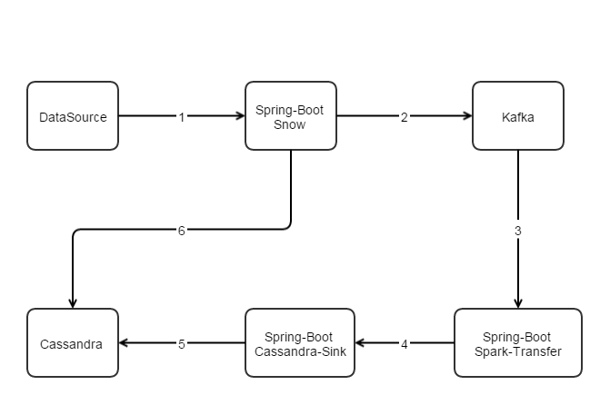

# Spring Cloud Stream
---
## 简介
关于Spring Cloud Stream，有很多类似的子project。它们有何异同？
### Spring XD
Spring XD是早期设计的分布式运行环境，其提供container和shell功能，在shell上通过配置流来实现大数据下的便捷开发。  
目前已将其重新设计为Spring Cloud Data Flow，不过前者的功能和文档都要比后者全很多，例如XD可以自定义并注册各个module。  
Spring XD功能较重，是一个庞大的运行环境，内集成大量lib，包括spark的1.4.1的lib。
### Spring Cloud Data Flow
Data Flow是XD的升级版。也提供container和shell功能，在shell上可以配置流。container和shell是以jar包形式运行
Data Flow的运行模式有多种，对应的github如下。
```
https://github.com/spring-cloud/spring-cloud-dataflow/tree/master/spring-cloud-dataflow-server-local[Local]
https://github.com/spring-cloud/spring-cloud-dataflow-admin-yarn[YARN]
https://github.com/spring-cloud/spring-cloud-dataflow-admin-cloudfoundry[Cloud Foundry]
https://github.com/spring-cloud/spring-cloud-dataflow-admin-mesos[Mesos]
https://github.com/spring-cloud/spring-cloud-dataflow-admin-kubernetes[Kubernetes]
```
以local模式为例:
```
redis-server
java -jar spring-cloud-dataflow-admin-local-1.0.0.M2.jar
java -jar spring-cloud-dataflow-shell-1.0.0.M2.jar
dataflow:>stream create ticktock --definition "time | log" --deploy
```
Data Flow运行**依赖于redis或者kafka**  
目前版本不支持使用本地jar包注册Data Flow的module，已有bugfix，后面应该会支持。目前Data Flow的shell功能以及手册远没有XD丰富。
### Spring Cloud Stream
为消息驱动的微服务提供架构，其基于Spring Boot、 Spring Integration。
>By adding @EnableBinding to your main application, you get immediate connectivity to a message broker and by adding @StreamListener to a method, you will receive events for stream processing.    

### Spring Cloud  Stream modules
使用Stream架构所构建的消息驱动的数据微服务。这些微服务通过两个重要的信息关联  
1. binder 微服务间的消息订阅系统，可以是kafka、redis等，这是Data Flow依赖于他们的原因。有数据关联的微服务应使用相同的binder。下面例子中两个微服务使用的binder是kafa。  
2. destination  微服务间的输入输出标记，如果一个微服务的输入是另一个微服务的输出那么他们的destination应相同。下面的列子中两个微服务的destination是ktest。
```
java -jar kafka-product-1.0-SNAPSHOT.jar  --spring.cloud.stream.bindings.output.binder=kafka --spring.cloud.stream.bindings.output.destination=ktest
java -jar cassandra-sink-1.0-SNAPSHOT.jar --spring.cloud.stream.bindings.input.binder=kafka --spring.cloud.stream.bindings.input.destination=ktest --ingestQuery='insert into te(time) values(?)' --keyspace=mykeyspace --contactPoints=127.0.0.1 --server.port=8801
```

## 实践
  
producer每秒产生一个字符串，通过binder交给kafka。producer和cassandra-sink通过ktest做输入输出的关联。  
### producer输出
```
{"time":"zhangsan Tue Apr 26 08:48:03 PDT 2016"}
{"time":"zhangsan Tue Apr 26 08:48:04 PDT 2016"}
{"time":"zhangsan Tue Apr 26 08:48:05 PDT 2016"}
```
### kafka检测
检测命令
```
bin/kafka-simple-consumer-shell.sh --broker-list localhost:9092 --topic ktest --partition 0  
```
观察结果
```
ontentType
          "text/plain"{"time":"zhangsan Tue Apr 26 08:46:18 PDT 2016"}
ontentType
          "text/plain"{"time":"zhangsan Tue Apr 26 08:46:19 PDT 2016"}
ontentType
          "text/plain"{"time":"zhangsan Tue Apr 26 08:46:20 PDT 2016"}
```
### cassandra检查
检查命令
```
cqlsh:mykeyspace> select * from te;
```
观察结果
```
 time
---------------------------------------
 zhangsan Tue Apr 26 08:46:28 PDT 2016
 zhangsan Tue Apr 26 08:46:43 PDT 2016
 zhangsan Tue Apr 26 08:46:44 PDT 2016
 zhangsan Tue Apr 26 08:46:30 PDT 2016
```
