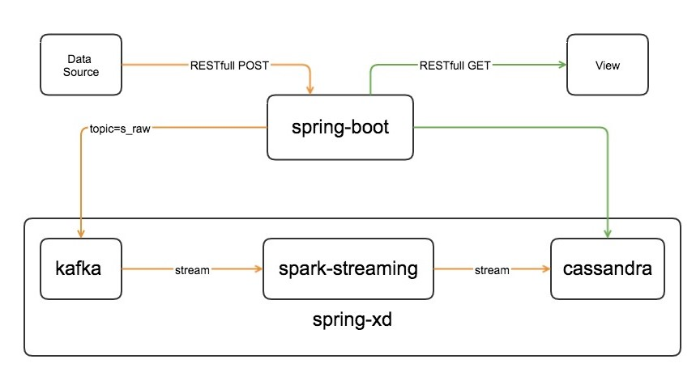
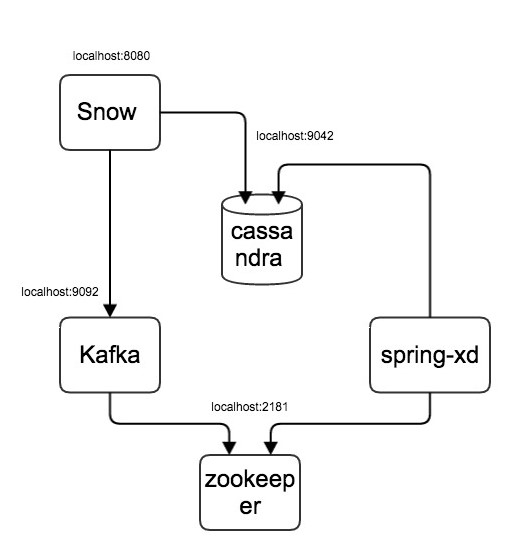

总体架构
---


### 1 主要开源组件

| 开源组件| 版本号|
| :------------- | :------------- |
|spring-boot|1.3.3.RELEASE|
|spring-xd|1.3.1.RELEASE|
|kafka|0.9.0.1|
|cassandra|2.2.5|
|spark|1.6.1|


### 2 项目代码说明

主要包含两个子模块

** snow **

snow通过jersey对外提供REST API，对应架构图中的spring-boot部分！主要有两个数据流向，生成者API部分作为kafka producer，会将数据发给kafka brokers。消费者API部分通过Spring-data-cassandra从cassandra数据库中读取数据。

snow通过jar包的方式进行部署对外提供服务。

** rain **

rain不是一个单独的功能模块，而是包含了很多功能模块的集合，这里存放了所有spring-xd的modules，这些modules可以直接通过update的方式插入spring-xd中作为source/processor/sink使用。

rain目前有两个modules:

- byte2string

   byte2string将字节类型的数据转换成字符串类型。需要该组件的原因是字符spring-xd中kafka作为source的时候，output的是byte格式的数据。

- find-list

    find-list实际完成过滤的功能，通过用户配置关键字，find-list调用spring-xd中集成的spark-streaming，通过RDD完成数据的过滤，返回符合条件的数据集。

rain中的modules都通过jar包的形式提供，jar包可以直接拷贝到spring-xd的环境中进行update成一个spring-xd的module.

### 3 启动服务
#### zookeeper
```
zookeeper-server-start.sh /usr/local/Cellar/kafka/0.8.2.2/libexec/config/zookeeper.properties
```
#### kafka
```
kafka-server-start.sh /usr/local/Cellar/kafka/0.8.2.2/libexec/config/server.properties
```
#### cassandra
```
cassandra -f
```

#### 启动spring-xd

```
xd-singlenode

xd-shell

```
### 4 spring-xd的命令介绍
spring-xd通过stream的形式来组织source/processor/sink,其中source和sink支持很多的主流的数据库系统。一个stream中必须有一个source和一个sink，可以有多个processor。

**添加module**

进入xd-shell之后，就可以通过module的命令添加上面通过rain生成的两个jar包了。

命令如下：

```
xd:>module upload --file /opt/flurry/find-list-processor-1.0-SNAPSHOT.jar --type processor --name find-list

Successfully uploaded module 'processor:find-list'
```

```
xd:>module upload --file /opt/flurry/byte2string-transformer-1.0-SNAPSHOT.jar --type processor --name byte2string

Successfully uploaded module 'processor:byte2string'
```

```
xd:>module list
      Source              Processor            Sink                     Job
  ------------------  -------------------  -----------------------  -----------------
      file                aggregator           aggregate-counter        filejdbc
      ftp                 bridge               cassandra                filepollhdfs
      gemfire             byte2string          counter                  ftphdfs
      gemfire-cq          filter               field-value-counter      gpload
      http                find-list            file                     hdfsjdbc
      jdbc                header-enricher      ftp                      hdfsmongodb
      jms                 http-client          gauge                    jdbchdfs
      kafka               json-to-tuple        gemfire-json-server      sparkapp
      mail                object-to-json       gemfire-server           sqoop
      mongodb             script               gpfdist                  timestampfile
      mqtt                scripts              hdfs
      rabbit              shell                hdfs-dataset
      reactor-ip          splitter             jdbc
      reactor-syslog      transform            kafka
      sftp                                     log
      syslog-tcp                               mail
      syslog-udp                               mongodb
      tail                                     mqtt
      tcp                                      null
      tcp-client                               rabbit
      time                                     redis
      trigger                                  rich-gauge
      twittersearch                            router
      twitterstream                            shell
                                               splunk
                                               tcp
                                               throughput-sampler
```

**创建stream**

将rain中的jar包添加为module之后，接着就可以创建stream了，这里我们要创建的steam的目的是从kafka中读取消息，然后送到spark-streaming中进行过滤，并将过滤结果放到cassandra数据库中的journey表中。

创建流的命令如下：

~~~
xd:>stream create test --definition "kafka --zkconnect=localhost:2181 --topic=test | byte2string | find-list --blackName='zhangsan,lili' | cassandra --ingestQuery='insert into journey(name, date, type, credentials, credentials_no, contact, flight, depart, dest, seat, airport, carriage, station) values(?,?,?,?,?,?,?,?,?,?,?,?,?)' --keyspace=mykeyspace --contactPoints=localhost" --deploy

Created and deployed new stream 'test'
~~~

演示
---

### 组网和配置

单机环境组网图和配置图如下所示：



~~~
kafka:
  broker:
    address: localhost:9092
  zookeeper:
    connect: localhost:2181
  topic: "test"
  messageKey:
zookeeper:
  host: localhost
  port: 2181
cassandra:
  address: localhost
  port: 9042
~~~
### REST API

#### 生产者API

##### Url

    POST  /journey

##### Params
~~~
{
  "name":  "张三",               //必选，姓名
  "type": "plane",              //必选，行程的类型
  "date":  "20160411",          //必选，日期
  "credentials":  "身份证"，     //证件类型
  "credential_no"："1234567",         //证件号码
  "contact":"888888",        //联系方式
  "flight": "CA1986",        //航班号
  "depart":  "beijing",       //出发地
  "dest":  "hangzhou",         //目的地
  "seat": "15F",             //座位号
  "airport":"首都机场"        //机场信息，飞机才有的信息
  "carriage": "",           //车厢号，火车才有的信息
  "station":""              //乘车车站，火车才有的信息
}
~~~

##### Result
~~~
{
    code: 200,              //标准的http错误返回码
    success: true,          //是否成功
    message: "successful",  //返回值信息，可以是成功或者获取失败之后的详细信息
}
~~~


#### 消费者API

##### Url

    GET  /journey

##### Params
~~~
  {
    "type":"plane",           //出行方式，plane或者train
    "name":"张三"，            //出行人姓名
    "start":"2016-04-02",     //出行起始日期
    "end":"2016-04-12",       //出行截止日期,可选，缺省等于起始日期
    currentPage:1,            //可选，当前页，缺省为1
    pageSize:20               //可选，每页记录数，缺省为20
  }
~~~

##### Result
~~~
{
    code: 200,              //标准的http错误返回码
    success: true,          //是否成功
    message: "successful",  //返回值信息，可以是成功或者获取失败之后的详细信息
    pageInfo:
    {
       currentPage: 1,     //当前页
       pageSize: 20,       //每页记录数
       total: 500          //总记录数
    }
    count:  20,             //本次获取的数量
    list:[
      {
        "name":  "张三",            //姓名
        "type": "plane",           //行程的类型
        "id":  "身份证"，           //证件类型
        "idno"："1234567",         //证件号码
        "contact":"888888",        //联系方式
        "date":  "20160411",     //日期
        "flight": "CA1986",        //航班号
        "depart":  "beijing",       //出发地
        "dest":  "hangzhou",         //目的地
        "seat": "15F",             //座位号
        "airport":"首都机场"        //机场信息，飞机才有的信息
        "carriage": "",           //车厢号，火车才有的信息
        "station":""              //乘车车站，火车才有的信息
      }
        ......
    ]
}
~~~

### 要添加的记录

~~~
{"name":"zhangsan","ID":"身份证","IDNo":"1234567","contact":"888888","date":"2016-04-11","flight":"CA1986","from":"beijing","to":"hangzhou","seat": "15F","type":"plane","airport":"首都机场"}

{"name":"zhangsan","ID":"身份证","IDNo":"1234567","contact":"888888","date":"2016-04-11","flight":"CA1986","from":"beijing","to":"hangzhou","seat": "15F","type":"train","airport":"首都机场"}

{"name":"lisi","ID":"身份证","IDNo":"1234567","contact":"888888","date":"2016-04-11","flight":"CA1986","from":"beijing","to":"hangzhou","seat": "15F","type":"train","airport":"首都机场"}
~~~


### 验证

**通过curl提交数据请求**
~~~
curl -l -H "Content-type: application/json" -X POST -d '{"name":"zhangsan","ID":"身份证","IDNo":"1234567","contact":"888888","date":"2016-04-11","flight":"CA1986","from":"beijing","to":"hangzhou","seat": "15F","type":"plane","airport":"首都机场"}' http://localhost:8080/journey

curl -l -H "Content-type: application/json" -X POST -d '{{"name":"zhangsan","ID":"身份证","IDNo":"1234567","contact":"888888","date":"2016-04-11","flight":"CA1986","from":"beijing","to":"hangzhou","seat": "15F","type":"train","airport":"首都机场"}' http://localhost:8080/journey

curl -l -H "Content-type: application/json" -X POST -d '{"name":"lisi","ID":"身份证","IDNo":"1234567","contact":"888888","date":"2016-04-11","flight":"CA1986","from":"beijing","to":"hangzhou","seat": "15F","type":"train","airport":"首都机场"}' http://localhost:8080/journey
~~~

**通过kafka consumer查看数据收到**

**通过cqlsh查看cassandra中确实有数据**

**通过curl获取数据**
~~~
curl http://localhost:8080/journey
~~~
